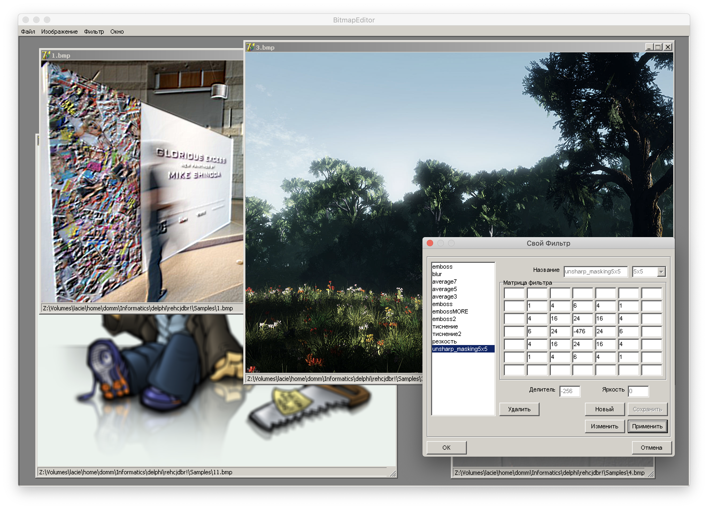

# Image Editor

> **Disclaimer**
> 
> This application was developed back in 2009 by Igor Khorlo as a high school project and uploaded to GitHub for archive purposes.

This application is an [MDI](https://en.wikipedia.org/wiki/Multiple_document_interface) raster image editor that I developed back in 2009 as a high school project. It was written in [Object Pascal](https://en.wikipedia.org/wiki/Object_Pascal) in [Delphi 7](https://en.wikipedia.org/wiki/Delphi_(IDE)) IDE for the [Windows NT](https://en.wikipedia.org/wiki/Windows_NT) operating system. MDI was a popular and trendy form of a UI at that time. The editor allows you to do the following 

* brightness, contrast adjustments
* discolor
* inverse colors
* [convolutional matrix (kernel) filters](https://en.wikipedia.org/wiki/Kernel_(image_processing)): 
    + box and gaussioan blurs
    + stamping
    + edge detection
    + sharpness
    + user defined.

It uses ScanLine API which was a very efficient way to manipulate bitmaps.

A **short video** showing the functionality -- https://youtu.be/XqkS_kg2UO8

## How to run it today?

Editor was developed under Windows XP back in 2009 (10 years ago for today, 15th May 2019), so if you are running Windows, you probably would be able to run natively the `Project1.exe` binary (maybe with some additional compatibility settings). On macOS and Linux, you would need [Wine](https://www.winehq.org/):

```sh
LC_ALL=ru_RU.UTF-8 wine Project1.exe
```

It was tested on macOS Mojave (10.14.4) in May 2019 and had no issues.

## Screenshots



